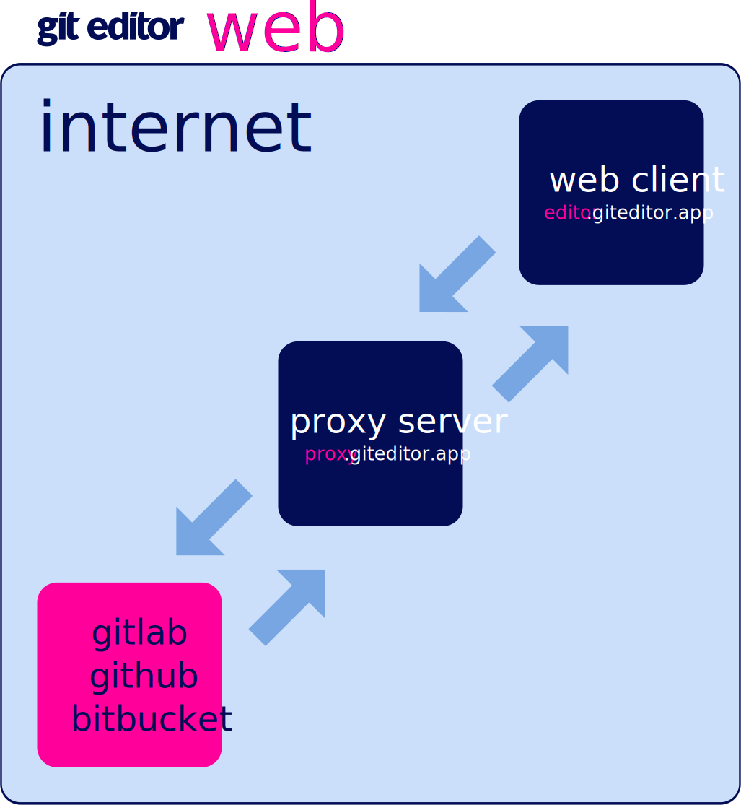
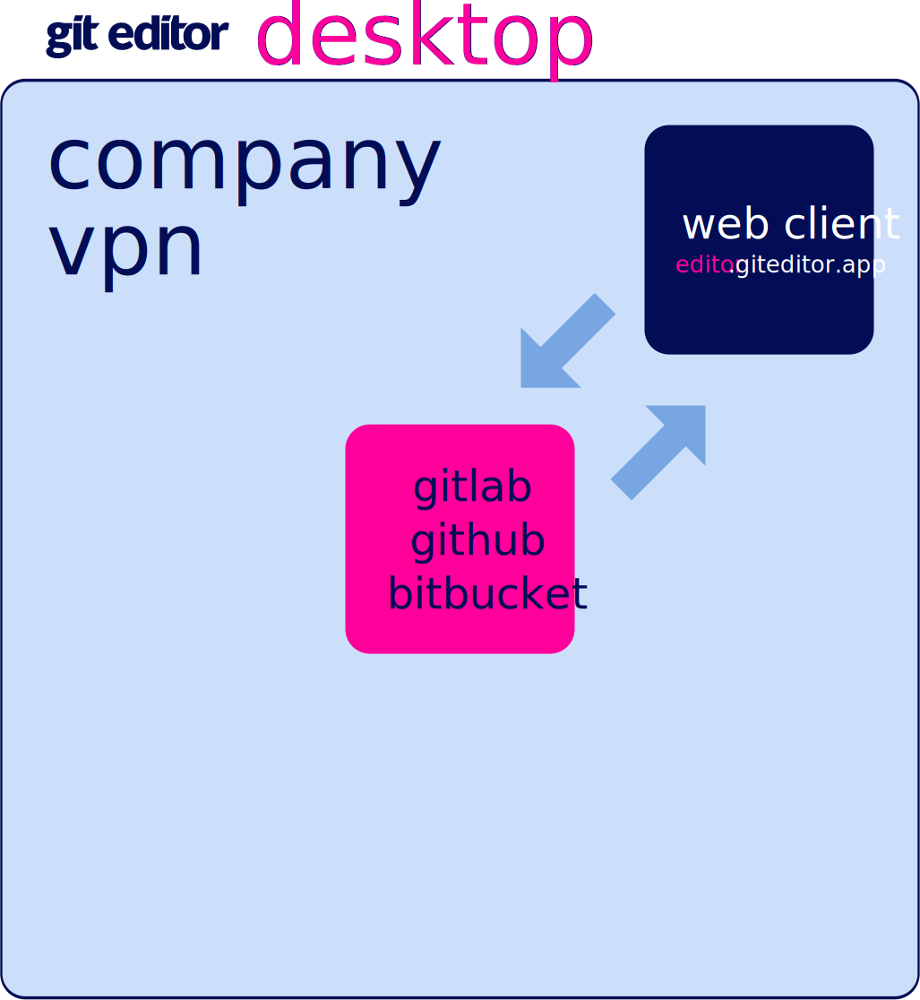

  

<h1 align="center">Git Editor<small></h1>

This is a repository for the users of Git Editor to report issues 😱 and feature ideas 🤩.

---

# Application Versions

The application has 2 versions at the moment. Desktop version is the web version integrated with Google's Chromium browser. It is ideal in corporate environments where the access to the code repositories is restricted to the internal network and where the company do not need to host neither the web client or the proxy.

